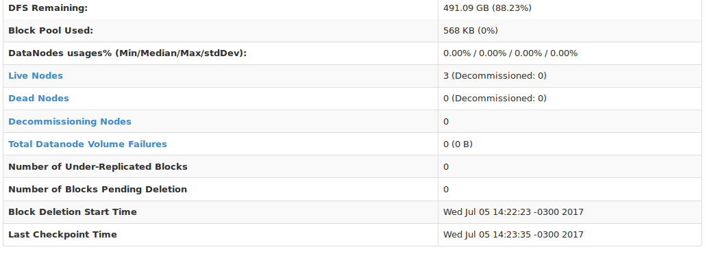
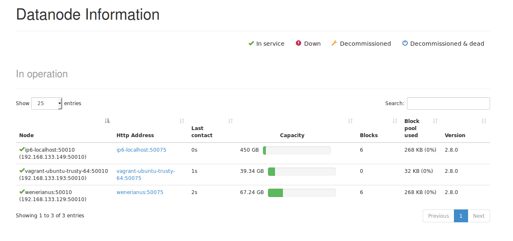

# Instalando hadoop em Standalone

- Você pode entrar na página do hadoop e escolher a [versão](http://hadoop.apache.org/releases.html).
- Nesse experimento usamos o seguinte [pacote](http://ftp.unicamp.br/pub/apache/hadoop/common/hadoop-2.8.0/hadoop-2.8.0.tar.gz)
- Para descompactar o arquivo use: `tar -xvzf hadoop-2.x.tar.gz`
- Onde `x` é a subversão do Hadoop 2.

- O tutorial usado para configuração do ambiente foi uma [página do site oficial](https://hadoop.apache.org/docs/stable/hadoop-project-dist/hadoop-common/SingleCluster.html#Purpose)

- Primeiramente é necessário ter instalado o Java instalado, nesse presente experimento será utilizado a plataforma Java Oracle 8, portanto basta escolher qual JVM deseja usar(open-jdk, oracle-jdk, etc). Você pode conferir se o seu ambiente já está devidamente configurado utilizando no seu terminal o seguinte comando:

```
$ echo $JAVA_HOME
/usr/lib/jvm/java-8-oracle`
```

- Se obtiver uma saída parecida, significa que seu ambiente Java já está devidamente configurado, caso contrário siga algum tutorial sobre a instalação do ambiente java e da configuração de suas variáveis de ambiente, necessários para o uso do hadoop. Existem vários desses tutorais, não vamos nos reter a isso.

- Além do java, existem duas dependências de sistema que é preciso configurar, `ssh e rsync`. Numa distro debian:

- `$ sudo apt-get ssh rsync`

- Primeiramente vamos tentar executar o ambiente em Standalone, modo local não distribuído.

- Para isso vamos mover a pasta descompactada acima para `/usr/`, alguns tutoriais usam a pasta `/etc`, isso não tem grande relevância:

- $ sudo mv hadoop-2.8.0/ /usr/

- Agora é preciso editar o bashrc para conseguir executar o Hadoop em qualquer terminal.

- `$ sudo vim ~/.bashrc`

- Você pode usar qualquer editor de texto para isso, uma vez em modo de edição, adicione ao final do arquivo os seguintes comandos:

```
# HADOOP VARIABLES - considering hadoop folder into /usr/
export HADOOP_HOME=/usr/hadoop-2.8.0
export PATH=$PATH:$HADOOP_HOME/bin:$HADOOP_HOME/sbin
export HADOOP_CLASSPATH=${JAVA_HOME}/lib/tools.jar

export HADOOP_OPTS=-Djava.net.preferIPv4Stack=true
export HADOOP_CONF_DIR=${HADOOP_HOME}/etc/hadoop

export HADOOP_MAPRED_HOME=$HADOOP_HOME
export HADOOP_COMMON_HOME=$HADOOP_HOME
export HADOOP_HDFS_HOME=$HADOOP_HOME
export YARN_HOME=$HADOOP_HOME
```

- Salve o arquivo, digite `bash` no seu terminal para as redefinir as configurações de bash e confira o resultado executando:

- `$ hadoop version`

- Deve aparecer uma tela mostrando a versão do hadoop seguido de outras informações.

- Para uma simples demonstração Standalone, vamos entrar dentro da nossa pasta do Hadoop `/usr/hadoop-2.8.0` e executar os seguintes comandos(Perceba que estamos dentro de `/usr/hadoop-2.8.0`):

```
/usr/hadoop-2.8.0$ cp etc/hadoop/*.xml input/

/usr/hadoop-2.8.0$ hadoop jar share/hadoop/mapreduce/hadoop-mapreduce-examples-2.8.0.jar grep input/ output 'dfs[a-z.]+'

```

- Após isso deve aparecer um grande log no seu terminal. Se você executar:

- `$ ls output/`

- Irá ver alguns arquivos criados na pasta pelo hadoop. Você acaba de executar seu primeiro código no hadoop.

# Configuração Distribuída

Para nossos experimentos é necessário a instalação distribuída, para isso é necessário configurar várias máquinas que serão os nós do cluster. Nesse experimento foi utilizado 3 nós, sendo 1 o master e slave, e os outros dois sendo apenas slaves, um será configurado junto ao master e o outro colocado depois, para demonstrar a elasticidade do sistema. Segue abaixo os procedimentos para configuração dos mesmos.

- Os passos a seguir foram feitos com algumas adaptações, mas ainda baseado nesse tutorial: https://linoxide.com/cluster/setup-hadoop-multi-node-cluster-ubuntu/

- Para prosseguir é necessário realizar a configuração Standalone acima.

- Para facilitar trabalhar com os endereços das máquinas, vamos editar o arquivo `/etc/hosts` em cada nó.

- No master, edite `/etc/hosts` no seguinte formato:

```
<ip-master>   localhost   <nome-da-maquina>   master
<ip-slave-1>  slave-1
```

- Para ver o `<ip-master>` e `<ip-slave-1>` basta digitarmos: `ifconfig` em cada um desses nós.
- O nome da máquina pode ser obtido usando o comando `$ hostname` no terminal.

- No slaves, edite também `/etc/hosts` no seguinte formato:

```
<ip-slave-1>   localhost   <nome-da-maquina>   slave-1
<ip-master>    master
```

- Para não ser preciso reconfigurar isso toda vez que um nó for desligado ou reconectado, pode-se fixar os IPs dessas máquinas.

- Para funcionamento mínimo da aplicação, o master deve se conectar aos slaves, ou melhor dizendo, o `NameNode` necessita precisa utilizar os `DataNodes`. Portanto precisamos configurar ssh para que a autenticação não barre isso.

- Então foi configurado chave ssh para que o `NameNode` possa fazer uso dos outros nós sem autênticação:

```
fsdadmin@HPHost02:~$ ssh-keygen -t rsa
Generating public/private rsa key pair.
Enter file in which to save the key (/home/fsdadmin/.ssh/id_rsa):
Enter passphrase (empty for no passphrase):
Enter same passphrase again:
Your identification has been saved in /home/fsdadmin/.ssh/id_rsa.
Your public key has been saved in /home/fsdadmin/.ssh/id_rsa.pub.
The key fingerprint is:
SHA256:mg6IeFhPq20/LDgvpTbDeaMIlq7fZpR+rHspsWAnQOE fsdadmin@HPHost02
The key's randomart image is:
+---[RSA 2048]----+
| ..              |
|..               |
|.E               |
|.                |
| .. ..  S        |
|.+=+*. o         |
|==o@+=o.         |
|+o@+@oB          |
|+++%*Xo.         |
+----[SHA256]-----+
...
```

- Para autorizar a chave criada no master, basta usar:

```
cat ~/.ssh/id_rsa.pub >> ~/.ssh/authorized_keys
```

- Teste se a configuração funcionou tentando usar:

```
$ ssh localhost
```

- Para copiar a chave ssh do master para os slaves, é necessário usar:

```
fsdadmin@HPHost02:~$ ssh-copy-id -i ~/.ssh/id_rsa.pub kuwener@slave-1
```

- Observe que nesse exemplo, 'kuwener' era nome do usuário da máquina slave, 'slave-1' o endereço dessa máquina.

- Costumam criar um usuário hadoop em todos os nós para facilitar essa configuração.

- Teste sua configuração:

```
ssh slave-1
```

- Agora é possível conectar master com master e master com slave.

- Desde já podemos notar a dependencia que o hadoop tem com o `NameNode`, tal que os `DataNodes` não precisam se conectar a ele para funcionamento mínimo do sistema, mas é crítico que ele consiga ter acesso a todos `DataNodes`.

- Agora para que a configuração distribuída funcione, é necessário em todos os nós configurar/criar um arquivo `masters` em `$HADOOP_HOME/etc/hadoop`:

```
master
```

- Esse arquivo simplesmente indica quem são os masters para o hadoop. É possível ter mais de um.


- Na mesma pasta, é necessário editar/criar um arquivo `slaves` com conteúdo no seguinte formato:

```
master
kuwener@slave-1
```

- Perceba, antes de `@` temos o nome de usuário, e após o endereço ip da máquina. Caso tivesse sido configurado um usuário em comum para todo cluster, seri necessário usar apenas o endereço, como o master.

- Além do mais, estamos colocando o master como um slave também, isso significa que apesar do nó ter um `NameNode`, ele também pode ter um `DataNode`.

- Em `$HADOOP_HOME/etc/hadoop/hadoop-env.sh` é necessário atualizar a definição da variável JAVA_HOME. Coloque a que está sendo usada no SO: `echo $JAVA_HOME`.

- Deve-se também criar os diretórios que irão compor o HDFS no `NameNode` e `DataNodes`.

- Foi escolhido:

```
mkdir -p $HADOOP_HOME/hadoop2_data/hdfs/namenode
mkdir -p $HADOOP_HOME/hadoop2_data/hdfs/datanode
```

- Agora uma série de arquivos de `$HADOOP_HOME/etc/hadoop`. É recomendado que se faça em um node e depois replique via `scp`.

- Em `core-site.xml`

```
<configuration>
    <property>
	    <name>fs.defaultFS</name>
	    <value>hdfs://master:9000</value>
    </property>
</configuration>
```

- Em `hdfs-site.xml`

```
<configuration>
	<property>
		<name>dfs.replication</name>
		<value>2</value>
	</property>

	<property>
		<name>dfs.permissions</name>
		<value>false</value>
	</property>

	<property>
		<name>dfs.namenode.name.dir</name>
		<value>/usr/hadoop-2.8.0/hadoop2_data/hdfs/namenode</value>
	</property>

	<property>
		<name>dfs.datanode.data.dir</name>
		<value>/usr/hadoop-2.8.0/hadoop2_data/hdfs/datanode</value>
	</property>

</configuration>
```

- Em `yarn-site.xml`

```
<configuration>
    <property>
	    <name>yarn.nodemanager.aux-services</name>
	    <value>mapreduce_shuffle</value>
    </property>
    <property>
	    <name>yarn.nodemanager.aux-services.mapreduce.shuffle.class</name>
	    <value>org.apache.hadoop.mapred.ShuffleHandler</value>
    </property>
</configuration>
```

- Em `mapred-site.xml`

```
<configuration>
  <property>
  	<name>mapreduce.framework.name</name>
  	<value>yarn</value>
  </property>
</configuration>
```

- Relembrando: Essa configuração acima deve ser igual em todos os nós.

- Agora é preciso formatar os nós para começar a usar, basta que no master se use: `hadoop namenode -format`

- Então, ainda no master, dentro da raiz do hadoop($HADOOP_HOME), use: `$ sbin/start-dfs.sh`

- Talvez será requisitado confirmação de autenticação, se nenhum erro ocorrer, o HDFS está preparado.

- Agora é necessário iniciar o yarn, para isso use: `$sbin/start-yarn.sh`.

- ATENÇÃO: Esses dois comandos acima apenas precisam ser executados no master, conhecido também por NameNode.

- Agora se executado `$ jps` no master, será obtido algo como:

```
$ jps
28640 NodeManager
27985 NameNode
28947 Jps
28137 DataNode
28330 SecondaryNameNode
28511 ResourceManager
```

- Nos slaves:

```
$ jps
20651 DataNode
20987 NodeManager
21133 Jps
```

- Se no NameNode e nos DataNodes não retornou algo parecido, algo provavelmente está errado.

- Para saber o status dos nós no cluster entre em http://master:50070/dfshealth.html

- Essa interface web tem várias informações sobre seu cluster, como espaço disponível, quais nós estão executando, onde estão eles e sua disponibilidade.


- Perceba que temos dois nós executando.

## Adicionando um novo nó

- Para adicionar um novo nó é bem simples, basicamente deve-se realizar os seguintes passos:

- Configurar o ambiente em Standalone

- Configurar o `/etc/hosts`, exemplo no caso de um novo node:

```
192.168.133.193 localhost vagrant       slave-2
192.168.133.129 slave-1
192.168.133.149 master
```

- Adicionar a linha do novo slave em `/etc/hosts` no master:

```
...
192.168.133.129 slave-2
```

- Configurar ssh do master para o `Datanode`.

- Atualizar o arquivo slaves, adicionando esse novo slave.

- É preciso ainda atualizar o arquivo `$HADOOP_HOME/etc/hadoop/slaves` com o novo node, para isso basta atualizar a master e dar scp em todos  `DataNodes`:

```
$ scp fsdadmin@master:/usr/hadoop-2.8.0/etc/ .
```

- Após devidamente configurados, deve-se restartar todo o serviço no master:

```
$ sbin/stop-all.sh
...
$ sbin/start-dfs.sh
...
$ sbin/start-yarn.sh
```

- Agora ao entrar na interface web: http://master:50070/dfshealth.html será possível ver 3 nós em execução:



- Se clicado no link "Live Nodes", é possível ainda obter mais detalhes:


