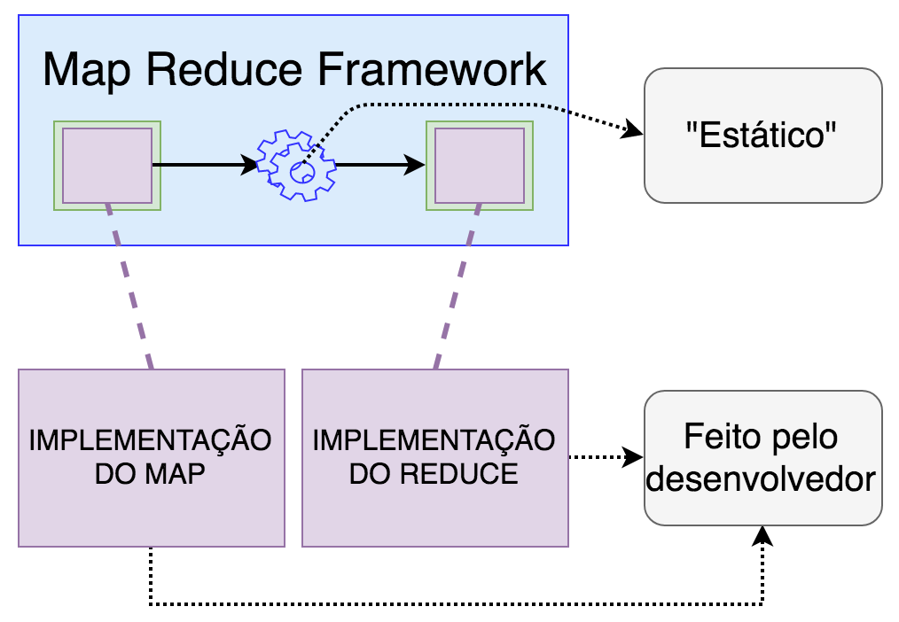
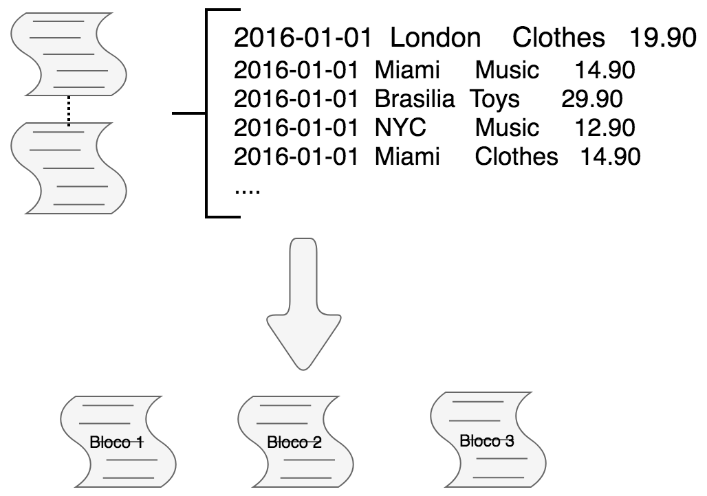
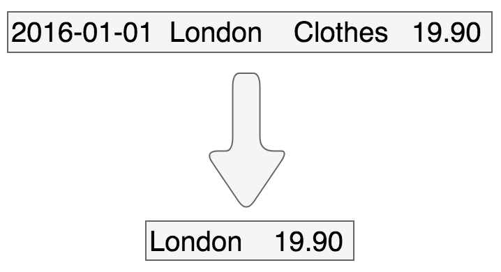
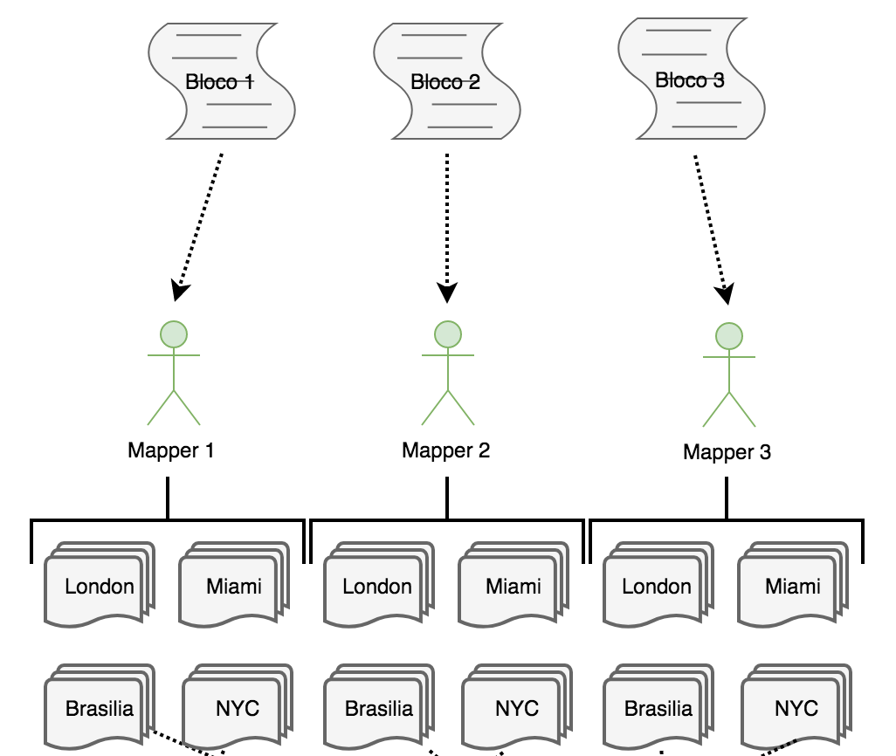
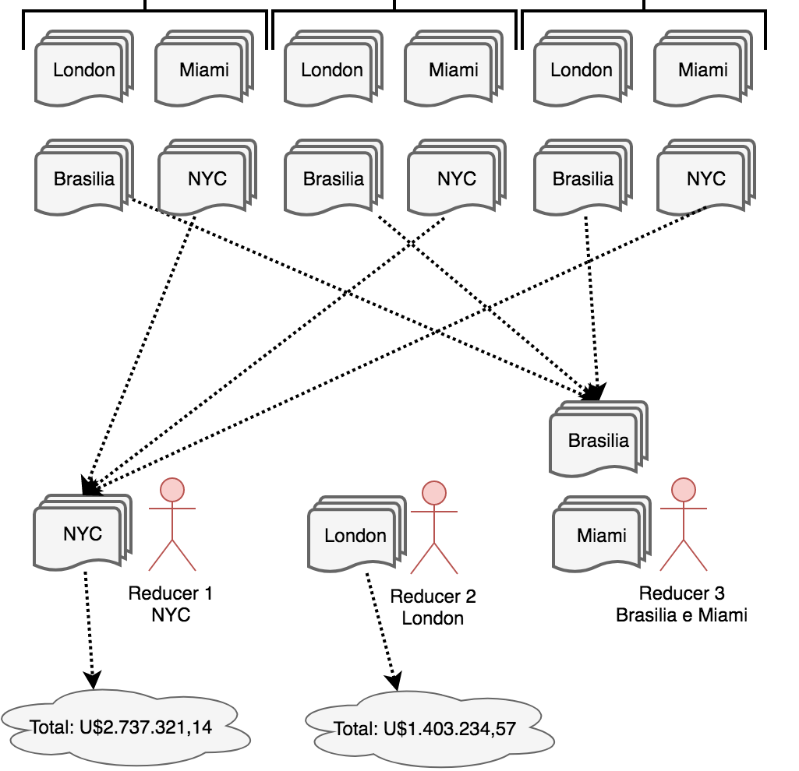
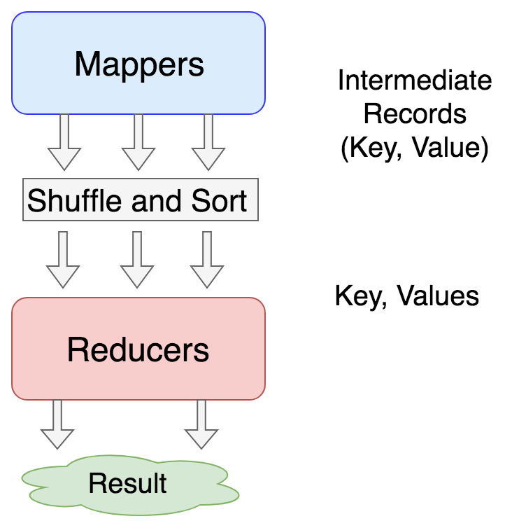
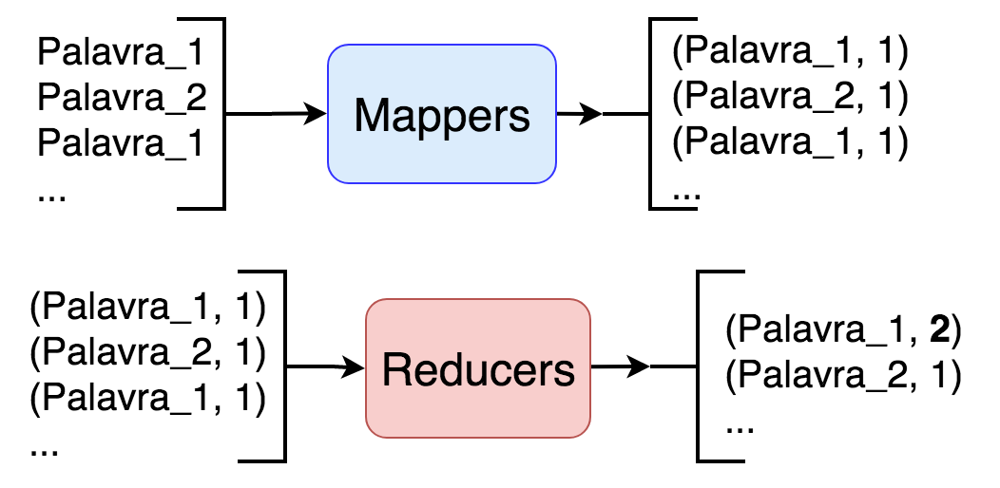

# MapReduce

O Core do Hadoop em suas primeiras versões consistia basicamente de dois "subsistemas":

- HDFS: Usado para armazenar os dados
- MapReduce: Usado para Processar os dados

Apesar de não ser mais necessário utilizar o MapReduce a partir da versão 2.0 do Hadoop, devido a introdução do YARN, ele ainda é bastante utilizado, e descreveremos seu funcionamento neste relatório.

## Contexto

Um dos primeiros obstáculos enfrentados pelo Google foi encontrar alguma forma para indexar um grande volume de dados da web que estava crescendo de forma exponencial. Para resolver esse problema, o Google inventou um novo estilo de processamento de dados chamado de MapReduce, isso permitiu que grande quantidades de dados fossem processados em um grande cluster composto por vários servidores.
MapReduce é um modelo, um paradigma de programação com uma implementação associada que facilita paralelismo durante processamento dos dados em grandes clusters, com uma grande quantidade de máquinas.

O Google, em 2004, lançou um artigo descrevendo o MapReduce. Este papel em conjunto com o artigo que descrevia o Google File System, foram utilizados como base para a criação do Hadoop.

## Como é utilizado pelo programador.

MapReduce é um modelo, um paradigma de programação
em que desenvolvedor se preocupa somente em descrever duas funções, o Map e Reduce.

Essas duas funções são executadas por um Framework que realiza passos intermediários e é responsável por distribuir o processamento entre as máquinas do cluster.

Para facilitar a explicação de como funciona o MapReduce foi criada a seguinte imagem abaixo.

<!--

-->


Conforme pode ser visto na imagem, o desenvolvedor se preocupa basicamente em implementar a função Map e a função Reduce, estas funções podem ser vistas como pontos extensíveis do framework. Partes do core do framework também pode ser modificadas através de arquivos de configuração, porém ele é bem mais estático.


## Quando utilizar MapReduce
Obviamente, só faz sentido utilizar Hadoop e MapReduce para contextos de Big Data, ou seja, quando uma grande quantidade de dados precisa ser processada.

De forma resumida, MapReduce é utilizado em situações em que a entrada, após ser processada, pode ser descrita como um par Chave-Valor e, posteriormente, essa o conjunto desses pares puderem ser processados pelos Reducers a fim de gerar um resultado.
Abaixo será descrito um exemplo a fim de exemplificar como esse modelo de programação funciona.


### Exemplo de MapReduce
Para explicar o funcionamento do MapReduce é interessante utilizar um exemplo. Abaixo será detalhado um cenário em que o MapReduce seria bem aplicado.

#### Cenário do exemplo
Suponha o seguinte cenário:
- Você foi contratado por uma grande empresa internacional com uma grande quantidade de lojas em diversos locais e cada uma realiza muitas vendas.

- Esta empresa tem um arquivo contendo todas as vendas do ano de 2016. Esse arquivo possui o seguinte formato:


```
Data da compra | Localização da loja | O que foi vendido | Preço

2016-01-01  London    Clothes   19.90
2016-01-01  Miami     Music     14.90
2016-01-01  Brasilia  Toys      29.90
2016-01-01  NYC       Music     12.90
2016-01-01  Miami     Clothes   14.90
...
```

- Dado esse arquivo com inúmeras linhas, o seu trabalho é extrair informações desse dado como por exemplo:

```
Qual foi o faturamento em cada loja?
```

#### Descrição da solução

Uma forma de resolver esse problema seria utilizando um par Chave-Valor, onde a chave seria a localização da loja e o valor o preço do produto vendido. Dessa forma, quando a chave repete, o valor é atualizado.


Então ao processar a primeira linha, obteríamos a seguinte tabela:

| Chave  | Valor |
|--------|-------|
| London | 19.90 |

Ao processar as quatro primeiras linha, obteríamos a seguinte tabela:

| Chave    | Valor |
|----------|-------|
| London   | 19.90 |
| Miami    | 14.90 |
| Brasilia | 29.90 |
| NYC      | 12.90 |

Ao processar a última linha, obteríamos a seguinte tabela:

| Chave    | Valor |
|----------|-------|
| London   | 19.90 |
| Miami    | 29.80 |
| Brasilia | 29.90 |
| NYC      | 12.90 |

Observe que foi atualizado o valor da Chave "Miami".

Caso uma grande quantidade de dados estivesse sendo processada por um programa convencional, provavelmente, demoraria muito tempo para obtermos e resultado e haveria um estouro de memória. Nesse contexto poderíamos aplicar o paradigma MapReduce.

Primeiramente, o arquivo seria quebrado em blocos menores (isso é feito pelo próprio HDFS). Essa etapa pode ser observada na imagem abaixo.

<!--

-->


Posteriormente, cada Mapper (quem executa a função Map), iria ler cada linha do arquivo e gerar uma saída indicando qual a loja e o valor.

<!--

-->


O Framework MapReduce irá ordenar o output dos Mappers antes deles serem utilizados como input para os Reducers. Ou seja, agrupará, todos os dados de acordo com as chaves. O resultado pode ser visto abaixo.

<!--

-->


Agora que todos os Dados estão agrupados de acordo com as chaves, o papel dos Reducers é somar os valores relacionados a cada par e gerar a receita total da loja de cada região.

<!--

-->


#### Map

Cada Mapper trata de uma parte dos dados e eles trabalham em paralelo. O output gerado por eles é chamado de "Intermediate Records", e este resultado é da forma Chave-Valor (no exemplo acima, a chave é a localização da loja e o valor o preço da venda).

A quantidade de Mappers está relacionada a quantidade de "input splits", que é um conjunto de "records" e normalmente tem o tamanho aproximado de um bloco (mas não exatamente), visto que um único "record" não pode ser quebrado e armazenado em blocos diferentes.

##### Exemplo de função Map em python

Normalmente e por padrão, os códigos para o Hadoop são escritos em Java. Porém, o Hadoop Streaming, permite que sejam utilizadas outras linguagens, nesse caso, utilizaremos python.

Exemplo de linha da entrada:
```
2016-01-01  London    Clothes   19.90
```

Baseado no formato das entradas demostrado abaixo, foi produzido o seguinte código para o Mapper.

Código:
```
def mapper():
  for line in sys.stdin:
    data = line.strip().split("\t")

    if len(data) == 4:
      date, store, item, cost = data
      print "{0}\t{1}".format(store, cost)
```

#### Shuffle and Sort (Simplificado)

Após executar a função Map, o framework executa as funções Shuffle e Sort.
De forma resumida, a função Shuffle está relacionado ao movimento dos "Intermediate Records" dos Mappers para os Reducers.
A função Sort está relacionada ao fato de que estes dados serão organizados de forma ordenada
Este tópico será melhor detalhado a seguir no relatório.


#### Reduce

Finalmente, cada Reducer trabalha em um conjunto de Registros de cada vez. Ele recebe a chave e um conjunto de valores relacionados aquela chave, processa esses dados de alguma forma (nesse exemplo, somamos todos os valores), depois ele escreve o resultado.
É interessante notar que, caso somente um Reducer esteja trabalhando, o resultado obtido provavelmente estará organizado de forma ordenada.

A quantidade de Reducers pode ser determinada pelo usuário. É possível, inclusive, não possuir nenhum Reducer para realizar determinada tarefa.

##### Exemplo de função Reduce em python

Normalmente e por padrão, os códigos para o Hadoop são escritos em Java. Porém, o Hadoop Streaming, permite que sejam utilizadas outras linguagens, nesse caso, utilizaremos python. O código Mapper pode ser visto abaixo.

Exemplo de linha da entrada:
```
London    19.90
```

Baseado no formato das entradas demostrado abaixo, foi produzido o seguinte código para o Reducer.

Código:
```
def reducer():

  salesTotal = 0
  oldKey = None

  for line in sys.stdin:
    data = line.strip().split("\t")

    if len(data) != 2:
      continue

    thisKey, thisSale = data

    if oldKey and oldKey != thisKey:
      print "{0}\t{1}".format(oldKey, salesTotal)

      salesTotal = 0

    oldKey = thisKey
    salesTotal += float(thisSale)

  if oldKey != None:
    print "{0}\t{1}".format(oldKey, salesTotal)
```


Abaixo está uma figura exemplificando o processo.

<!--

-->


### Rodar em Python

```
hadoop jar <path to hadoop streaming .jar> -mapper <mapper.py / mapper code> -reducer <reducer.py / reducer code> -file <mapper code path> -file <reducer code path> -input <input directory> -output <output directory>
```

### Como testar o Código sem o Hadoop
É possível testar o código escrito em Map Reduce sem utilizar o Hadoop. Isto pode ser feito com a ajudo do comando sort do linux.

```
cat testfile | ./mapper.py | sort | ./reducer.py
```

Para gerar o "testfile" a partir do arquivo original podemos fazer o seguinte:

```
head -50 <path do arquivo original> > testfile
```


### Outras aplicações
Outras aplicações interessante de MapReduce são:

- Processar logs.
- Sistemas de Recomendação
- Detecção de Fraude.
- Classificações.
- etc

Todas essas aplicações tem características em comum, o trabalho pode ser paralelizado, e muitos dados a devem ser processados.


## Core do Framework MapReduce

A principal contribuição do framework MapReduce não são as funções map e reduce, mas a escalabilidade e tolerância a falhas obtidas, para uma série de aplicações, ao otimizar o core de execução. Dessa forma, uma implementação single-threaded do MapReduce, normalmente, não será mais rápido do que uma implementação tradicional.

Ao comentar sobre o MapReduce é essencial descrever o funcionamento as funções Shuffle e Sort.

### Shuffle

A fase de shuffle consiste em transferir os dados dos Mappers para os Reducers.

Essa fase pode começar antes da fase de mapping terminar para economizar algum tempo. É por isso que as vezes vemos que que o status da fase de Mapping não está em 100% e a fase de Reducing está com o status maior que 0% (mas menor que 33%).

A fase de shuffle se preocupa em agrupar os pares Chave-Valor que contém a mesma chave, para que um conjunto de chaves iguais não seja dividido entre vários reducers.
Durante a fase de Map, cada conjunto de chaves iguais é armazenado em um "Partioner". O número desses "Partitioners" é igual ao número de Reducers. Cada chave com um valor específico irá para a partição associada. E reducer ficará responsável por uma partição.

### Sort

Assim que as chaves são salvas na partição correta, durante a fase de "Partitioning", o framework do Hadoop começa a ordenar os pares de acordo com as chaves.

Ao garantir que as chaves estão ordenadas, economiza-se o tempo do Reducer, tornando mais simples identificar quando uma nova tarefa de reducing deve começar. Ou seja, ao comparar a chave da tarefa atual com a chave da última tarefa, e elas forem diferentes, sabe-se que uma nova tarefa de reduce deve ser aplicada ao novo conjunto de dado.

Dessa forma, a garantia de que as chaves estão ordenadas é fundamental para o correto funcionamento de um programa escrito seguindo o paradigma MapReduce.

### Combiner (Opcional)

Durante a fase de Mapping também seria possível acrescentar uma fase intermediária, chamada de "Combine". Combiner são utilizados para reduzir a quantidade de dados que são enviados para a fase "Reduce". Eles funcionam como "Reducers", mas atuam durante a fase de Sort. Suponha o exemplo citado no tópico anterior, poderíamos calcular quanto cada loja vendeu durante a fase de sort e enviar esse total para a fase de Reduce. Isto seria interessante caso o "reducer" estivesse sobrecarregado.


## MapReduce Design Patterns (Resumo)

Existem uma série de Design Patterns utilizados para MapReduce, aqui serão descritos somente três destes padrões.

### Filtering Patterns

Este padrão serve para filtragem de dados, ou seja, ele não modifica as entradas dos dados.
Um exemplo, seria escolher somente algumas das linhas do nosso arquivo original e ignorar outras.

Alguns exemplos de utilização desse padrão são:
- Amostragem de dados
- Lista de Top-N

No exemplo citado de Top-N, cada Mapper gera o seu Top-N e, por fim, o reducer combina os Top-N de todos os Mapper, gerando um Top-N global.

### Summarization Patterns

Esses são padrões que dão um entendimento simples, rápido do conjunto de dados com o qual estamos trabalhando.

Alguns exemplos de utilização desse padrão são:
- Contagem de dados / registros (Ex: Contador de palavras)
- Encontrar Mínimo / Máximo
- Calcular dados estatísticos (Ex: Média, Desvio Padrão, Mediana, ...)
- Criar Index (Ex: Em quais locais do livro posso encontrar uma palavra específica?)

### Structural Patterns

É um padrão bastante utilizado quando deseja-se migrar dados de um Banco de Dados Relacional para o Hadoop. Dessa forma, dados que estão relacionados via chave secundária, podem ser combinados de forma hierárquica.
Dessa forma, esse padrão normalmente é utilizado para combinar conjuntos de dados, tabela de bancos relacionais.


## Aplicação de MapReduce neste projeto

Neste projeto foi elaborada uma aplicação bastante simples de MapReduce, que consiste de um contador de palavras.

O papel dos Mappers é de basicamente criar, a partir das palavras de entrada, um par chave-valor. A chave sendo a própria palavra e o valor sendo o número de ocorrências, nesse caso, sempre 1.

O papel do Reducer será receber esses pares de Chave-Valor já ordenados e somar o valor de todas as chaves semelhantes.

A imagem abaixo demonstra como funcionará este processo.

<!--

-->


O código java pode ser encontrado em anexo.
